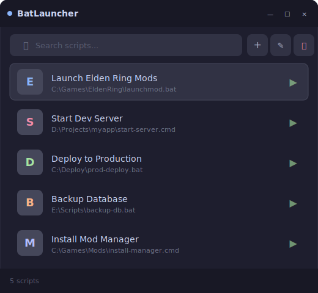
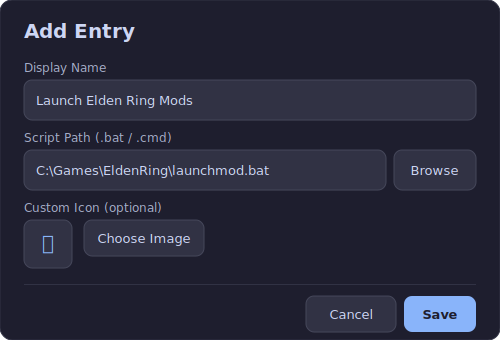

<div align="center">

# BatLauncher

A fast, modern launcher for `.bat` and `.cmd` scripts on Windows 10/11.

Pin it to your taskbar, click it, and run your scripts instantly.


</div>

---

## Preview

### Floating Toolbar

Appears above the taskbar when you launch the app. Click any icon to run the script.

<div align="center">


</div>

### Management Window

Full management with search, add, edit, and delete. Open it from the gear icon.

<div align="center">



</div>

### Add / Edit Dialog

Set a custom display name, pick your `.bat`/`.cmd` file, and optionally add a custom icon.

<div align="center">



</div>

---

## Features

- **Floating toolbar** — horizontal bar above the taskbar with script icons
- **One-click launch** — click an icon to run the script instantly
- **Custom names** — display names without renaming the original file
- **Custom icons** — PNG, JPG, ICO, BMP — copied to AppData so originals can be deleted
- **Search** — filter scripts by name or path in the management window
- **Persistent data** — stored in `%LOCALAPPDATA%\BatLauncher\data.json`
- **Taskbar pinnable** — standard `.exe`, pin it to your Windows taskbar
- **Dark theme** — Catppuccin Mocha color scheme
- **Fast startup** — ReadyToRun (R2R) precompilation, deferred data loading (~800ms cold start)
- **Lightweight** — ~258 KB executable (framework-dependent)

---

## Requirements

- Windows 10 or 11 (x64)
- [.NET 9 Desktop Runtime](https://dotnet.microsoft.com/download/dotnet/9.0)

---

## Install

### From Release

1. Download `BatLauncher.exe` from [Releases](../../releases)
2. Place it wherever you want
3. Right-click → **Pin to taskbar**
4. Done

### Build from source

```bash
git clone https://github.com/YOUR_USER/BatLauncher.git
cd BatLauncher/BatLauncher
dotnet publish -c Release -o ../publish
```

The executable will be at `publish/BatLauncher.exe`.

---

## Usage

| Action | How |
|---|---|
| **Run a script** | Click its icon on the toolbar, or double-click in the management window |
| **Add a script** | Click `+` on the toolbar or management window |
| **Edit a script** | Select it in the management window → click the edit button |
| **Delete a script** | Select it → click the delete button → confirm |
| **Open management** | Click the gear icon on the toolbar |
| **Search** | Type in the search box in the management window |
| **Move toolbar** | Drag it to any position on any screen |

---

## Data Storage

All data is stored in:

```
%LOCALAPPDATA%\BatLauncher\
├── data.json          # Script entries
└── icons\             # Copied icon images
```

Custom icons are **copied** into the `icons` folder, so you can safely delete the originals.

---

## Architecture

```
BatLauncher/
├── Models/            # BatEntry, AppData
├── ViewModels/        # MVVM — MainViewModel, BaseViewModel, RelayCommand
├── Views/             # ToolbarWindow, EditDialog
├── Services/          # DataService (JSON persistence)
├── Converters/        # WPF value converters
├── Resources/         # Theme.xaml (Catppuccin Mocha), app.ico
├── MainWindow.xaml    # Management window
└── App.xaml           # Application entry point
```

Built with **WPF** on **.NET 9**, no external dependencies.

---

## License

MIT
